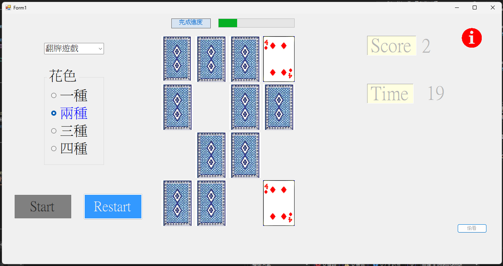
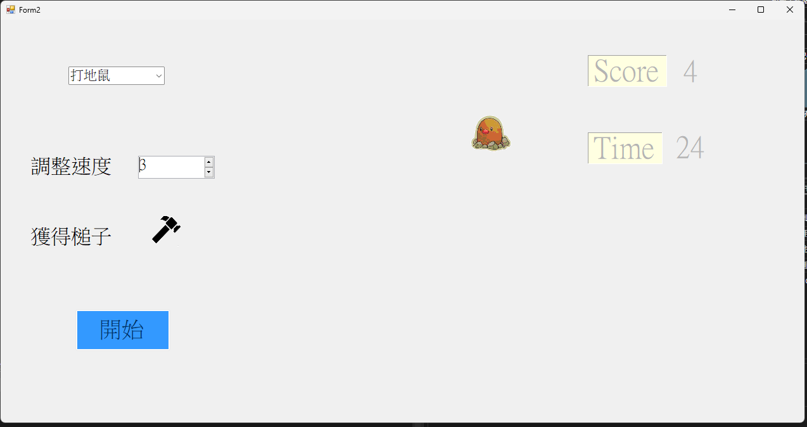

# C#小遊戲

## 說明

- 透過遊戲的方式熟悉 c#
- Form：Form1 為翻牌遊戲, Form2 為打地鼠遊戲
- PictureBox： 顯示圖片與觸發點擊事件
- Timer：計算開始後持續時間
- Label：顯示文字
- MessageBox：彈出元件，用於顯示訊息

## 操作&控制

- 點擊左上方下拉式選單選擇遊戲
- 翻牌遊戲
  1. 選擇出現的花色種類
  1. 按下 Start 開始遊戲
  1. 一次點擊 2 張牌面背面直到出現相同花色&數字
  1. 按下 Restart 重新一局
- 打地鼠
  1. 輸入或調整速度大小以控制地鼠出現速度
  1. 點擊槌子按鈕後滑鼠將變成槌子圖示
  1. 點擊開始後倒數 30 秒
  1. 成功打擊一次分數加 1 分

## 畫面

